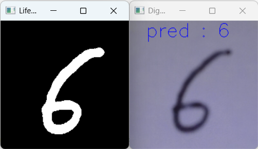
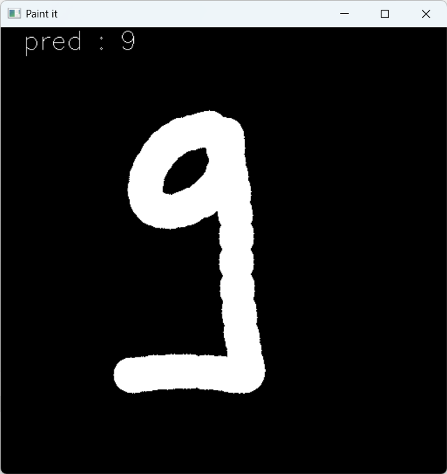

# Camera Recognition and Paint Project with CNN and KNN

This project demonstrates two practical applications using machine learning (KNN) and deep learning (CNN) models. It utilizes OpenCV for camera-based digit recognition and a drawing interface for painting.

## Technologies Used

- **Scikit-Learn**: For training and using KNN models in Machine Learning.
- **Keras (with TensorFlow)**: For training and using CNN models in Deep Learning.
- **OpenCV**: For handling the camera feed and creating the painting interface.

## Features

### 1. Camera Recognition with CNN (Keras)

This CNN model is designed to detect a **single digit** in real-time from images captured by a camera. The model works best with a **white background** and **black digits**. It detects and classifies the digit shown in front of the camera.



#### How to Use

1. **Set up the camera**: Ensure that your camera is properly connected to your computer.
2. **Run the script**: Execute the Python script to start real-time digit recognition.
3. **Digit Detection**: The model will recognize and display the detected digit from the camera feed, assuming the background is white and the digit is black.

### 2. Paint with KNN and CNN (Scikit-Learn and Keras)

This application allows users to **draw a single digit** on a canvas **with their mouse**. You can use either the KNN or CNN model to predict the digit you have drawn.



#### How to Use

1. **Draw a digit**: Use the canvas to draw a **single digit**. Right-click to erase the canvas and redraw if needed.
2. **Prediction**: The selected model (either KNN or CNN) will process the drawing and predict the digit on the canvas.

## Models

- **CNN (Deep Learning)**: The CNN model is trained on digit images and saved as an `.h5` file. It is used for both camera-based digit recognition and digit painting prediction.
- **KNN (Machine Learning)**: The KNN model is trained on digit images and saved as a `.pkl` file. It is used for digit painting prediction.

## Setting up the Virtual Environment and Installing Dependencies

### 1. Create a Virtual Environment

First, you need to create a virtual environment to isolate the project's dependencies. Follow the steps below to create and activate the virtual environment.

#### On **Windows**:

```bash
python -m venv myenv
myenv\Scripts\activate
```

#### On **macOS/Linux**:

```bash
python3 -m venv myenv
source myenv/bin/activate
```

### 2. Install Dependencies

Once the virtual environment is activated, install all required dependencies from the `requirements.txt` file:

```bash
pip install -r requirements.txt
```

### 3. Verify Installation

To verify that all dependencies have been installed correctly, you can run the following command:

```bash
pip list
```

This will display the list of installed libraries in your virtual environment.

### 4. Deactivate the Virtual Environment

When you are finished, you can deactivate the virtual environment by running the following command:

```bash
deactivate
```
